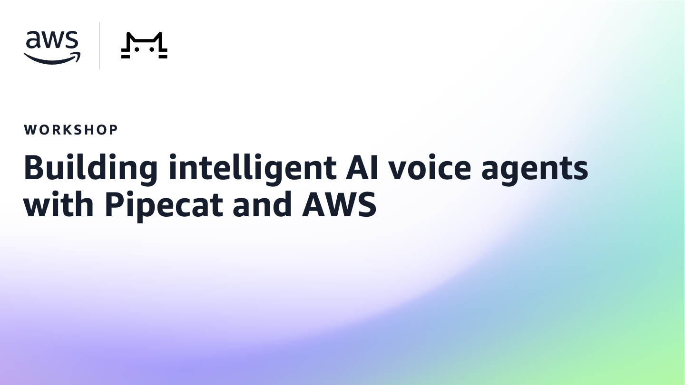

# Workshop: Building intelligent voice agents with Pipecat and AWS

This repository contains source code accompanying the [Building voice agents with Pipecat and AWS workshop](https://catalog.workshops.aws/voice-ai-agents/). Each lab in this repository includes its own setup guide. Before you begin, follow the workshop instructions to configure your AWS environment and review the corresponding `README.md` file for specific lab details.